# :world_map: Internet-in-a-Box on Android

**[Internet-in-a-Box (IIAB)](https://internet-in-a-box.org) on Android** will allow millions of people worldwide to build their own family libraries, inside their own phones!

As of April 2026, these IIAB Apps are supported:

* **Calibre-Web** (eBooks & videos)
* **Kiwix** (Wikipedias, etc)
* **Kolibri** (lessons & quizzes)
* **Maps** (satellite photos, terrain, buildings)
* **Matomo** (metrics)

The default port for the web server is **8085**, for example:

```
http://localhost:8085/maps
```

## What are the current components of "IIAB on Android"?

* **IIAB-oA Controller app** — Complete Android native app to Install, Use, Share and Build your setup in your pocket.
* **Wrapper to install IIAB (iiab-android)** — sets up [`local_vars_android.yml`](https://github.com/iiab/iiab/blob/master/vars/local_vars_android.yml), then launches IIAB's installer
* **Core IIAB portability layer** — modifications across IIAB and its existing roles, based on [PR #4122](https://github.com/iiab/iiab/pull/4122)
* **proot-distro service manager (PDSM)** — like systemd, but for `proot_services`

## Related Docs

* **Android bootstrap (in this repo):** [`termux-setup/README.md`](https://github.com/iiab/iiab-android/blob/main/termux-setup/README.md)
* **proot_services role (in IIAB's main repo):** [`roles/proot_services/README.md`](https://github.com/iiab/iiab/blob/master/roles/proot_services/README.md)

---

# User Manual
## Internet-in-a-Box on Android (IIAB-oA)

## 1. Introduction
Internet-in-a-Box on Android (IIAB-oA) is a mobile application designed to provide a system of online educational services and content for areas without an internet connection.

This development has evolved from its previous Termux-dependent versions; this new iteration is an all-in-one application (manager, installer, and viewer) that allows any Android device to become an offline content server (running on Debian ARM), hosting vital tools such as Wikipedia (Kiwix), Kolibri, interactive IIAB Maps, digital libraries, and even offline code editor (Code on the Go) powered by core IIAB.

<p align="center">
  
</p>


## 2. Main Interface and Sections

### Initial Setup and Permissions
When opening the application for the first time, the **Initial Setup** screen will appear. This interface is a mandatory step to ensure that the Debian server and heavy modules can run in the Android environment without restrictions.

The interface requires the activation of 4 special permissions:

1. **Push Notifications:** Allows the application to send floating alerts about server status, errors, or completed synchronization processes.

2. **Local Storage Access:** This is the most critical permission. It stores Wikipedia zim files, Calibre books, and downloaded Maps (which can exceed 50 GB in size). Without this permission t will be possible to backup content out of the app itself to regular storage.

3. **Display over other Apps:** Allows the IIAB-oA controller to keep floating windows or visual processes active while the user performs other tasks on the phone.

4. **Disable Battery Optimization:** Crucial for performance. By default, Android closes resource-heavy applications running in the background to save battery. By "de-optimizing" the app, the IIAB-oA server is granted permission to run indefinitely even if the screen is off.

**Additional Options on this Screen:**

* **"Manage all permissions" Button:** Opens the native Android settings for the device, allowing you to thoroughly review granted access or troubleshoot if a button gets stuck.

* **Content Language:** A dropdown selector that allows you to choose the native language in which the server will be configured.

<p align="center">
  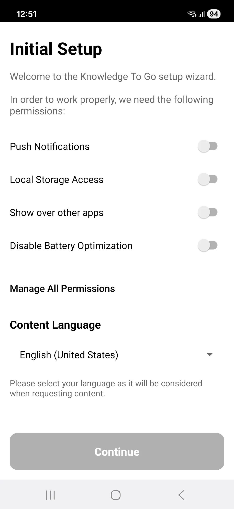
  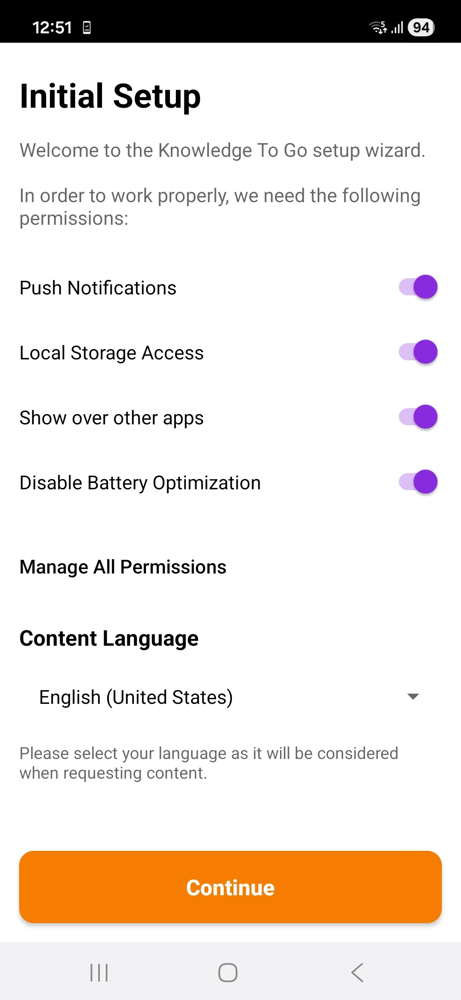
</p>

### Status Tab: System Monitoring
This is the home screen. Here you can monitor your device's health and the server's status.

* **Device Information:** Displays the phone model, Android version, device architecture, uptime, battery status, storage usage, and current connection (Wi-Fi and Hotspot).

* **Server Status:** Allows you to see if the IIAB-oA server is offline or online, indicating the architecture of the base operating system running in the background (e.g., Debian ARM64).

* **Available Modules:** Shows the available services and indicates those currently installed on your device (Books, Code, Kiwix, Kolibri, IIAB Maps, System).

<p align="center">
  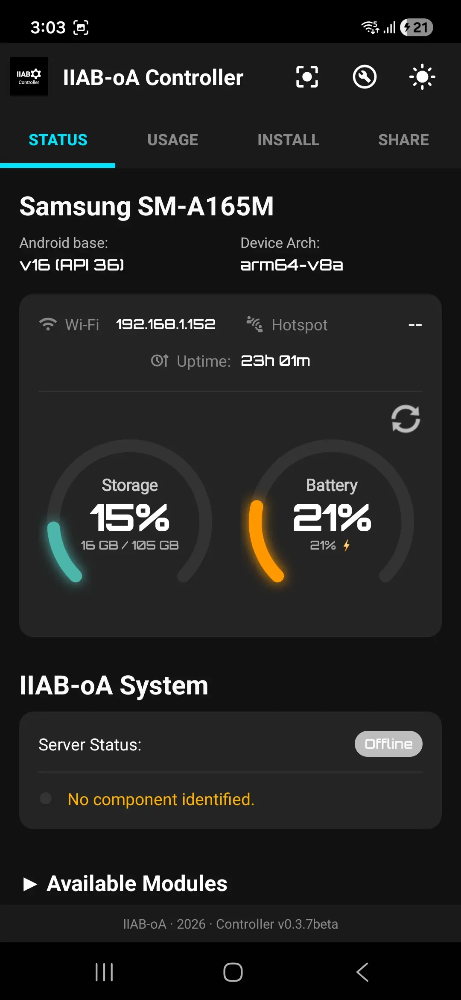
  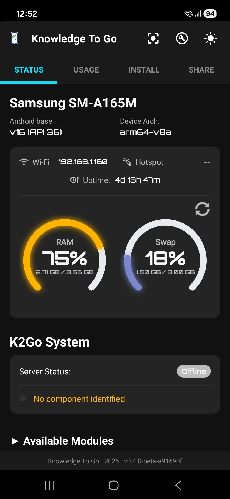
  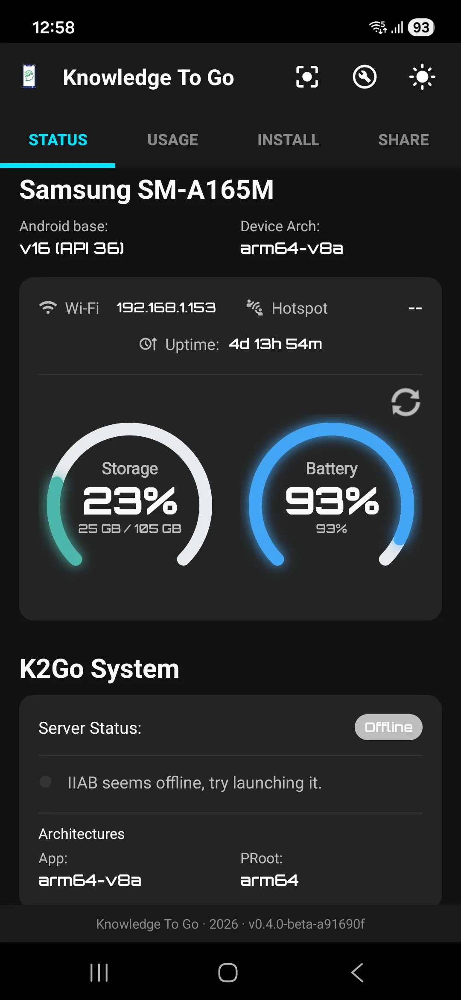
</p>


### Use Tab: Content Explorer
From here, you can access and interact with the modules you have installed using the application's internal browser.

* **Start/Stop Server:** Main button to turn the services on or off. It is always recommended to stop the server from here before closing the app to prevent errors.

* **Explore Content:** Opens the integrated viewer (without a URL bar to prevent external navigation) where you will find direct access to tools like Kiwix (offline Wikipedia), maps, books, and programming applications.

* **Share Content Access:** Through Wi-Fi or Hotspot, it is possible to share access to the content on the device with other equipment on the network, via easy-to-scan QR codes.

* **Connection Log:** A real-time log to visualize active processes and connections, ideal for debugging.

<p align="center">
  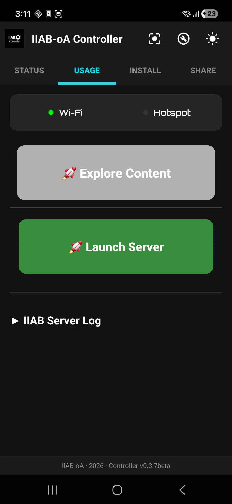
  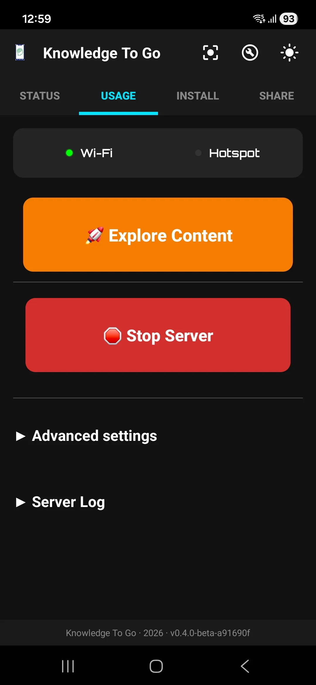
  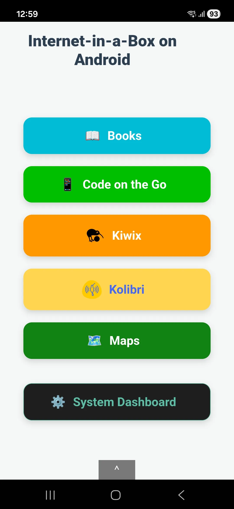
</p>


### Install Tab: Module Management
The control center to download and manage the size and content of your offline server. Requires an internet connection for the initial download.

* **Quick Installation:** Offers three pre-configured packages in 3 tiers, where adding content (ZIMs or Maps) is optional.
    * **Basic:** Only essential software: Kiwix and IIAB Maps.
    * **Standard:** An additional step up that includes Kolibri, just enough to increase educational use with extensive content.
    * **Complete:** The entire available catalog (Books, Kiwix, Maps, etc.) which, by adding optional content, can weigh over 50 GB on some languages.
* **Maintenance and Recovery:** Tools to create backups of your system, restore previous backups, force stop processes, or perform a base reset (wiping the installation for a manual setup).

* **Module Management:** While all three levels cover the main educational tools, you can manage modules individually.
    * **Matomo (Analytics)** is fully supported, but it is not installed by default at any level to save space and resources, as it is generally not essential for end users. You can install it manually from this tab.

<p align="center">
  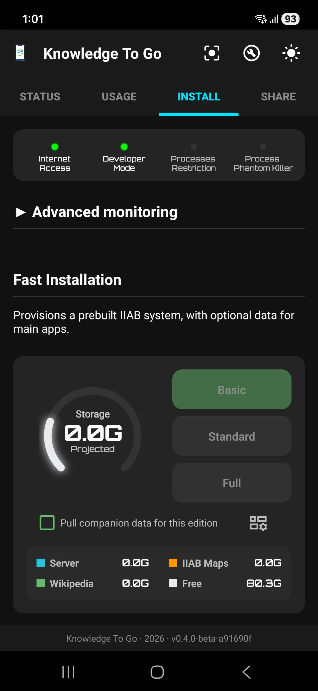
  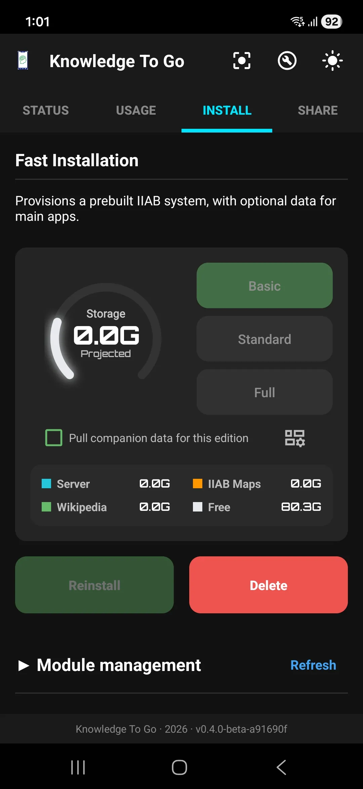
  <br><br>
  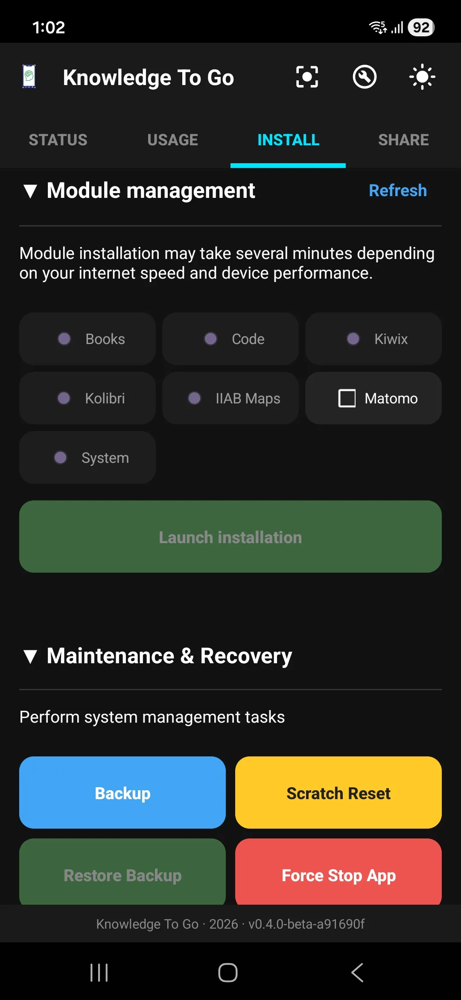
  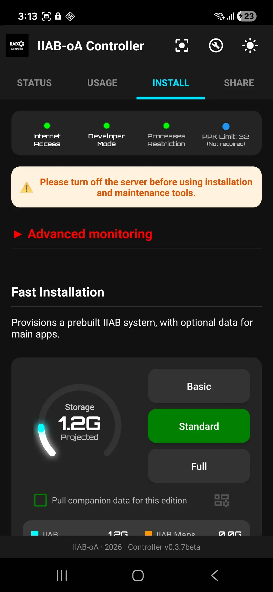
</p>

### Send Tab: Share System
Allows you to share offline content with other users around you, using local Wi-Fi or the device's Hotspot.

* **Share System vs. Receive System:** You can scan or generate a QR Code to transfer (copy) the environment to another device, more below.


* **Transfer vs. Access:** When sharing, it is vital not to confuse two important options:
    * **Grant Access (Client Experience):** Allows other devices to consume the content hosted on your phone. When a client scans it, their default web browser will open automatically displaying a web version of the IIAB-oA menu. No app installation is required on the client's end even possible to browse on desktop on the same network.

    <p align="center">
      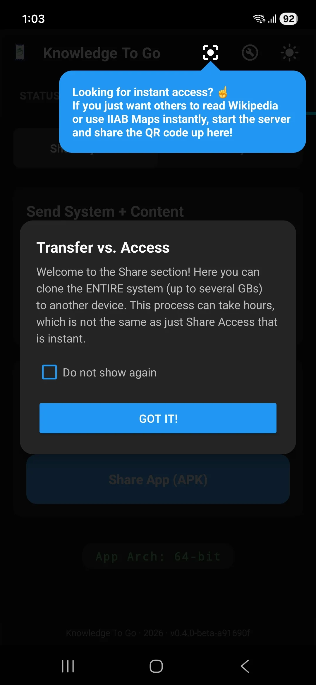
      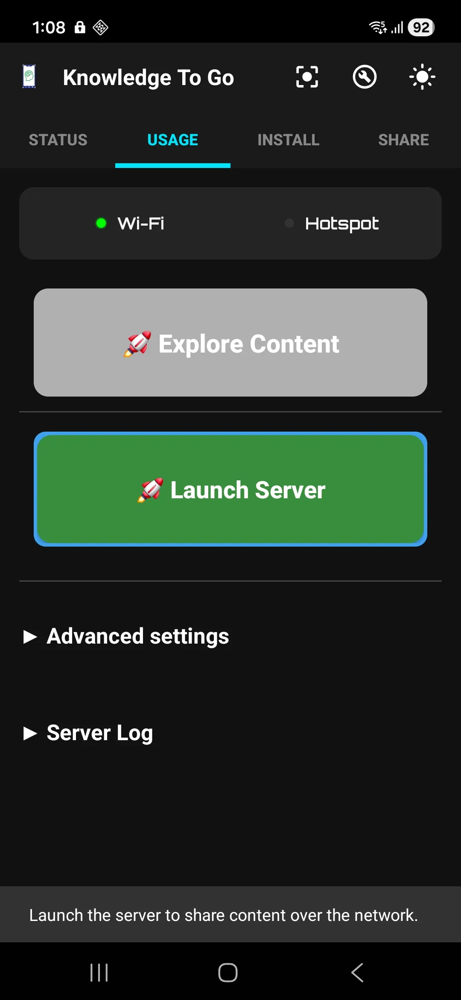
      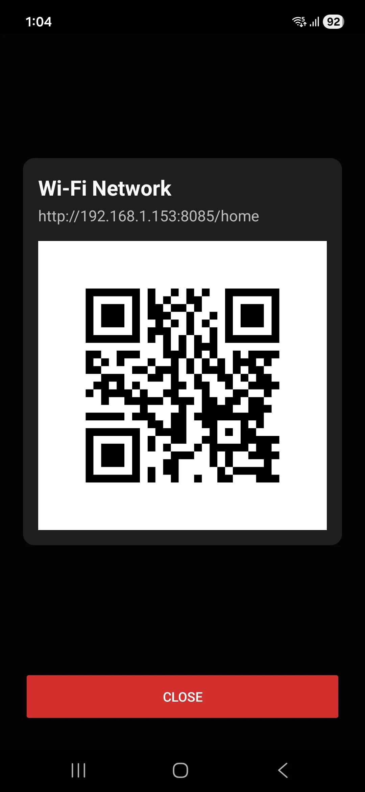
    </p>

    * **Transfer (Cloning):** Transfers massive files (up to tens of gigabytes) using *rsync* technology so that the other device gets an exact and independent copy of the original server without needing the Internet.

    <p align="center">
      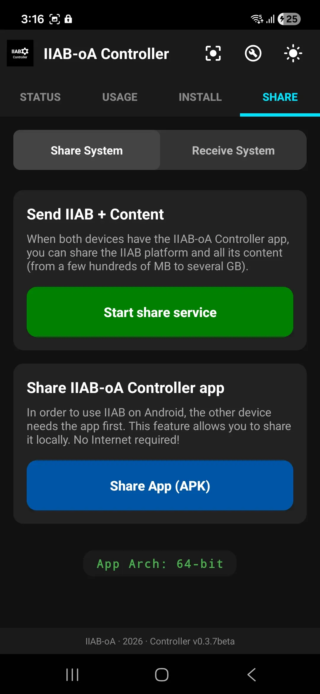
      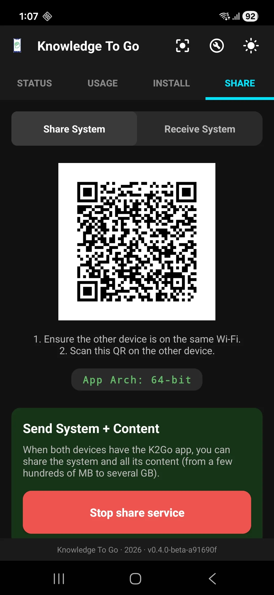
      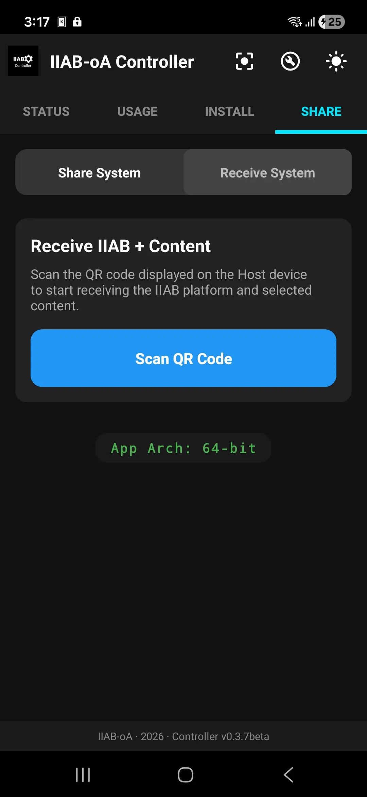
    </p>


## 3. Use Cases

### **Providing Wikipedia access in a classroom without internet**
A teacher in a rural area needs their students to research history. The teacher activates the "Hotspot" on their phone, starts the server from the **Use** tab of IIAB-oA, and selects "Share Access". The students connect to the teacher's network, scan the QR code, and can browse the entire Wikipedia on their ouwn language (via Kiwix) from their own devices without consuming mobile data.

### **Downloading a specific map for fieldwork in an area with poor connectivity**
A team of volunteers is traveling to a rural municipality where cellular coverage is known to be spotty. Before leaving (while they still have internet access), they go to the **Use** tab, open "Maps". They select the specific region they will be visiting (FQR - Full Quality Regions), and execute the download command via the **System Dashboard**. Upon arrival, they can comfortably view street layouts and local points of interest offline, avoiding roaming charges and not relying on an unstable mobile data plan.

### **Replicating the server on a colleague's phone**
An educational promoter travels to an isolated community. They meet a community leader with a compatible phone and want to leave the system installed for them. The promoter goes to the **Send** tab, selects **Transfer**, and the leader scans the QR code from the **Receive** tab. An exact copy of the 38 GB of content begins transferring to the new phone wirelessly.

## 4. Special and Advanced Features

* **Android Restriction Management (Phantom Process Killer)**

    For clean installations or massive transfers, Android (versions 12 and up) often kills heavy background processes. The installation tab detects if you have Developer Options enabled and guides you to connect ADB and disable these restrictions when necessary, ensuring that massive downloads and installations are not interrupted.

<p align="center">
  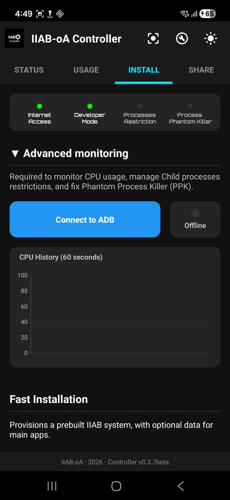
  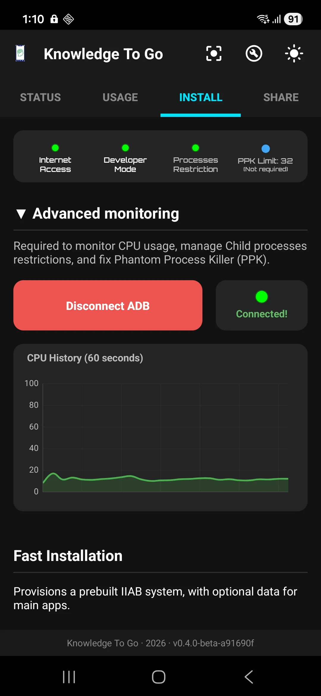
  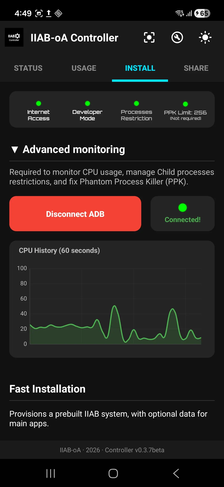
</p>

* **System Dashboard (Web)**

    An exclusive control panel for IIAB-oA that allows you to manage downloads and elements (such as extracting map regions) from the web browser without needing to use command lines for Kiwix, Maps, and Books from known repositories.

<p align="center">
  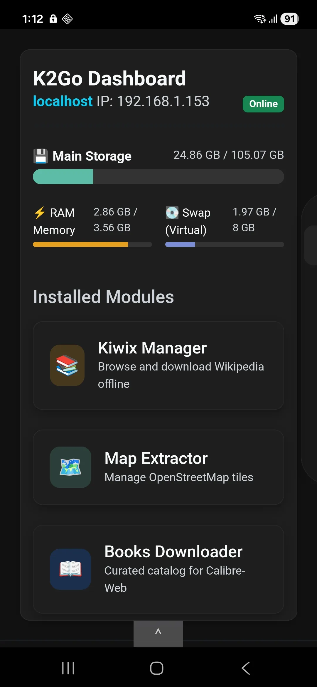
  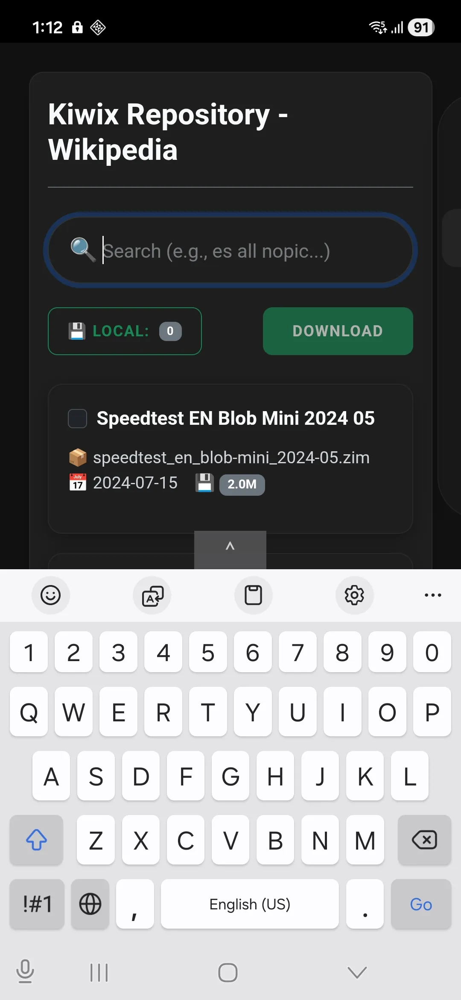
</p>

* **The Hidden Terminal**

    For power users who need to interact directly with the Debian environment:

    1. Go to the bottom of any tab.

    2. Press and hold the footer (the section showing the app version) for 3 seconds.

    3. A minimalist slide-out Terminal will appear.

        From here, you can access the Debian 13 operating system that powers our IIAB server, where you will have the ability to test and execute the core IIAB tools inside PRoot and install a large number of packages from Debian repositories itself.

    4. To hide it, you can simply press the back button or perform the back gesture several times, or unlock it at the top and slide the panel down.

<p align="center">
  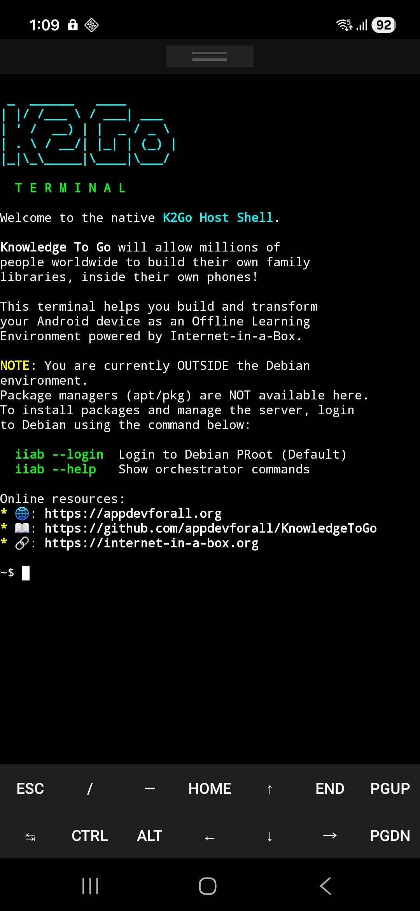
  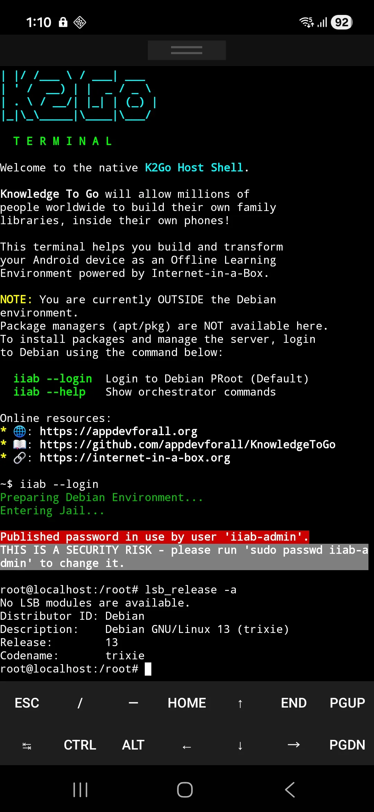
</p>
test
