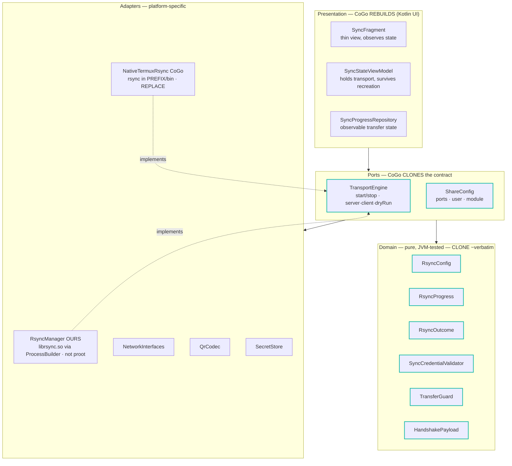
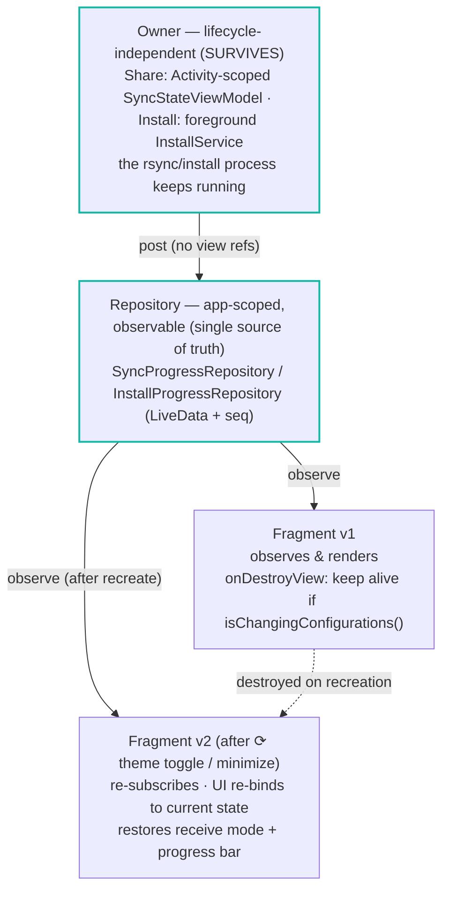

# Share (rsync) feature — design overview (S14 / ADFA-4492)

A one-page map of how the **Share** tab is structured after the carve, for the team and
for the **Code on the Go (CoGo)** clone. Detailed analysis: `SHARE_FEATURE_EXPORT_ANALYSIS.md`.
Metaphor: we tidied the house so colleagues can take photos and rebuild it in their own
house (Kotlin). The Java domain core is callable from Kotlin unchanged, so the job is
**isolating the mechanic from the app scaffolding**, not translating code.

## 1. Export architecture — what CoGo clones vs. rebuilds

**Key finding that frees the feature from proot (EX1):** the binary path and the process
environment are owned by the **adapter**, not by the `TransportEngine` contract. Our adapter
runs the native `librsync.so`; CoGo's adapter runs `rsync` from their Termux `$PREFIX/bin`.
The domain (conf/argv/payload/progress/exit-code) is identical for both.

**Clone / rebuild / replace:**

| Piece | For CoGo |
|---|---|
| `RsyncConfig`, `RsyncProgress`, `RsyncOutcome`, `SyncCredentialValidator`, `TransferGuard`, `HandshakePayload` | **Clone** — pure logic, compiles under Kotlin as-is |
| `TransportEngine`, `ShareConfig` (+ QrCodec / NetworkInterfaces / SecretStore as interfaces) | **Clone the contract**, implement the body for their host |
| `RsyncManager`, Android QR/camera, file `SecretStore` | **Replace** with their Termux launcher + platform adapters |
| `SyncFragment` UI, tab wiring, `MainActivity.isServerAlive` coupling | **Rebuild** in Kotlin against the ViewModel/ports |
| rootfs-ABI matching, APK-share mode, proot rootfs source | **Drop / re-decide** — IIAB-specific |

## 2. How a long operation survives recreation

The same pattern powers the install (ADFA-4474) and the share transfer (ADFA-4492):
**separate who does the work from who shows it.** A theme toggle / rotation destroys the
*View*, not the *work*.

**Why it works:** the worker's listeners **post to the repository and never touch the dead
fragment's views**, and `onDestroyView` does not stop the work during a configuration change.
The recreated fragment reads the same state and continues to completion. Cancel and terminal
(success/error, fired once via `seq`) flow through the same repository.

## 3. Carve status (all merged to `main`)

| Step | What | PR |
|---|---|---|
| 1 | Pure rsync domain (`RsyncConfig`/`RsyncProgress`/`RsyncOutcome`) + JVM tests | #93 |
| 2a | `TransportEngine` port + `ShareConfig` (RsyncManager becomes the adapter) | #94 |
| 3a | `NetworkInterfaces` + `QrCodec` + `SecretStore` (EX3, S11) | #96 |
| 3b-1 | Concurrency/lifecycle hardening (S8/S9/S10) | #98 |
| 3b-2 | Transfer survives recreation (ViewModel + observable repository) | #99 |
| 4 | `TransferGuard` (EX6) + authorship headers (EX4) | (this line) |

Remaining polish (own follow-up, lower export value): S15 theming, S16 magic strings,
D17 ApkServer hardening + bind-to-selected-interface.
